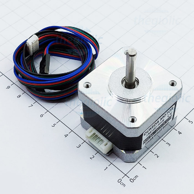
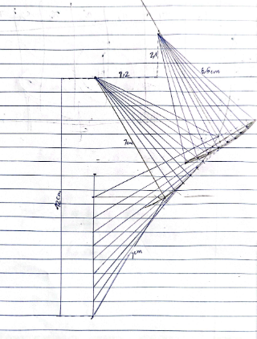
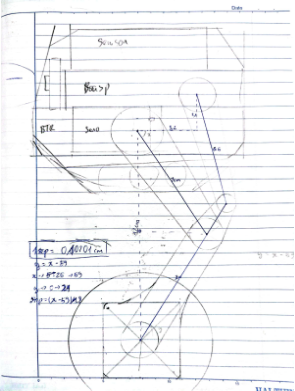
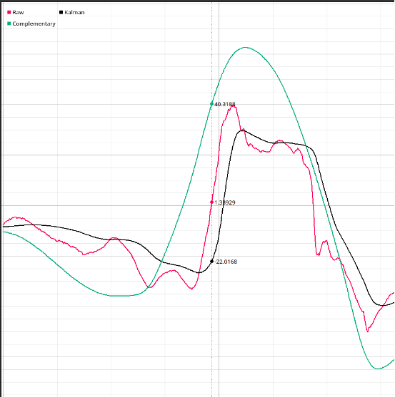
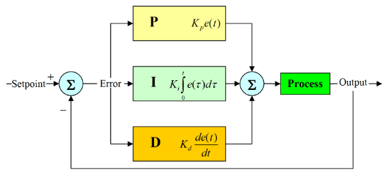

# MIPI Robot

## MIPI Robot

Đây là dự án cá nhân của mình. Với mục đích cho đồ án chuyên ngành trong trường VKU. Robot được lấy ý tưởng từ Robot Ascento. Mình thấy cơ chế robot cân bằng với 2 chân có thể co duỗi được thực sự là bài toán thú vị, ngoài việc cân bằng đơn thuần, Robot cần phải đứng lên ngồi xuống, khi đó các hệ số cân bằng PID cũng phải thay đổi theo. Khi có tác động bên ngoài Robot cũng phải giữ được vị trí và trạng thái ổn định ban đầu.


Các độ dài khớp chân cũng phải tính toán kĩ để khi co duỗi không bị nghiêng. Mình đã tính toán khá kĩ nhưng gia công lại lệch :v

## Robot cân bằng là gì?

Đầu tiên nói về Robot cân bằng. Robot cân bằng là một hệ thống phản hồi kín, bao gồm động cơ và cảm biến góc, cảm biến sẽ liên tục trả về trạng thái góc của Robot, vi điều khiển sẽ tính toán và đưa ra tốc độ phù hợp để Robot có thể giữ trạng thái góc cần thiết, thường là góc thẳng.

## Lựa chọn phần cứng

Robot cân bằng cần độ ổn định cao, nên linh kiện cũng cần có các yêu cầu nhất định

- Động cơ có moment xoắn ổn định ở các tốc độ. Ở đây mình kiến nghị 2 option, động cơ bước và động cơ 3 pha không chổi than ( loại có số KV thấp khoảng 100KV - 300KV, thường cho gimbal máy ảnh). Cả 2 loại động cơ này có moment xoắn ít phụ thuộc vào tốc độ như động cơ DC (điều khiển tốc độ bằng hiệu điện thế), chúng điều khiển bằng độ dài của chu kì xung nên khi quay chậm hay nhanh đều có lực moment xoắn gần như tương đồng. Động cơ không chổi than thì giá khá cao, và cần encoder cùng FOC driver. Quá mức tài chính của mình, nên mình chọn động cơ bước _Nema17_ cùng driver _A4988_ làm động cơ cho Robot



- Vi điều khiển thì không khắt khe, các bạn có thể sử dụng bất kì loại nào như PIC, Arduino, ESP32, STM32,... Không nên dùng Raspberry Pi, vì năng lượng tiêu thụ lớn và tốc độ phản hồi chậm hơn so với thao tác trực tiếp trên thanh ghi như ESP32 khíến độ ổn định thấp hơn. Raspberry Pi chỉ nên dùng cho nhưng robot có kích thước lớn, khi mà tốc độ nghiêng thấp và động cơ khỏe như BLDC. Với động cơ bước thì khi nghiêng chậm 1 chút là không thể đứng lên nổi. Ở đây mình chọn ESP32, vì tích hợp sẵn wifi, bluetooth và giá thành rẻ
- Servo cho phần chân, lúc đầu mình sử dụng MG996R cho phần chân, nhưng cơ chế đòn bẩy như Ascento cần nhiều lực hơn mình nghĩ. Nên mình phải dùng Servo 20KG để có thể nâng toàn bộ thân Robot lên
- Cảm biến góc nghiêng, giá rẻ, thông dụng và hiệu quả - MPU6050 là sự lựa chọn tối ưu đối với dự án này. Nhược điểm của những cảm biến góc nghiêng giá rẻ là nhiễu khá lớn. Vấn đề này mình sẽ dùng bộ lọc nhiễu để xử lý ở phần dưới.

## Thiết kế phần cứng

Mình muốn thiết kế một Robot nhỏ nhỏ xinh xinh, nên kích thước chỉ cần vừa đủ với các thành phần linh kiện đã lựa chọn. Đầu tiên để các chân robot khi co duỗi có thể tịnh tiến thẳng đứng, tránh khi đứng thì ngẩng đầu mà ngồi thì lại cúi, mình đã tính toán trên giấy các thông số.



Độ cao của chân mình ước tính khi duỗi là 12cm, khi đó 2 khớp chân sẽ hơi gập, nên mình đặt là 7cm cho mỗi khớp chân. Để cố định khớp chân khi co duỗi, mình lắp thêm 1 thanh đỡ bằng cách kéo dài khớp dưới thêm 2cm. Sau khi tính toán quỹ đạo của phần thừa đó khi chân co duỗi, mình nhận thấy nó gần giống quỹ đạo 1 cung tròn. Bây giờ chỉ cần tìm tâm của cung tròn đó là có thể xác định chiều dài của khớp phụ và điểm gắn vào phía bên kia của thanh đỡ đó. Sau khi đo đạc, mình xác định được chiều dài khớp phụ là khoảng 6.5mm, vị trí như trên hình vẽ

Sau khi có được độ dài các khớp chân, mình phác họa thêm vị trí các thành phần để dễ hình dung hơn



Vậy là xong phần thiết kế cho Robot. Tiếp theo là đến phần thi công

## Thi công Robot

### Chân Robot

Do kiến thức còn hạn hẹp và ví còn nhỏ :v nên mình sẽ tự khoan cắt các thành phần thay vì in 3d hay cắt laser.

Chân robot mình sử dụng tấm nhựa ABS 5mm, các bạn nên chọn tấm mỏng hơn để tránh cưa bong hết tay như mình, tấm nhựa này cứng khủng khiếp 🥲


Sau khi cắt mỏi tay thì ướm vào hơi lệch 🤨 Thôi chắc không sao đâu.

## Thân Robot

Phần thân mình sẽ sử dụng hộp nhựa 120x120. Sau khi tính toán và sắp xếp mình quyết định làm phần Pin hình chữ T, lí do mình chọn pin 3S bởi vì động cơ bước này yêu cầu nguồn từ 12v - 36v, các bạn có thể dùng pin 1s rồi dùng mạch Buck lên cũng được


## Lập trình

### Lựa chọn bộ lọc cho MPU6050

Sau khi thử nghiệm, mình nhận thấy độ nhiễu của MPU6050 thực sự không thể bỏ qua được. Qua vài giờ nghiên cứu và đọc các bài báo thì mình tìm được có 2 bộ lọc thường dùng cho MPU6050 là Kalman Filter và Complementary Filter. Mình tạo ngay 2 chương trình để test. Các bạn có thể tham khảo ở các video sau:

[Complementary Filter](https://youtu.be/OTuk-GdoPUQ?si=rBCbIQHjm8ZyZI2G)

[Kalman Filter](https://www.youtube.com/watch?v=lGwCoa1R5o0)

Và mình dùng Serial Plot để so sánh phản ứng giữa 2 bộ lọc này. Kết quả như sau:



Có thể dễ dàng nhận thấy được, Kalman filter phản ứng chậm hơn so với dữ liệu gốc, nhưng nó cũng bám sát hơn. Complementary Filter thì khi có biến động nó lại phản ứng nhanh hơn cả dữ liệu gốc, dù cho mình đặt Alpha khá cao (0.996). Nên rõ ràng Complementary phù hợp hơn cho Robot cân bằng.

Mình đã tham khảo thư viện MPU6050_tokn và viết lại thành 2 file để đọc dữ liệu từ cảm biến MPU6050 trên [mpu_6050.cpp](./src/mpu_6050.cpp) và header file [mpu_6050.h](./src/mpu_6050.h).

### Lập trình Timer cho A4988

Nguyên lý của A4988 khá đơn giản, chỉ cần cấp liên tục xung vào chân step, cứ mỗi chu kì, động cơ sẽ quay 1 bước. Bước lớn hay nhỏ tùy vào các chân config. Hướng quay thì tùy vào trạng thái HIGH hay LOW của chân Dir. Phần này có 1 thầy trên youtube giảng khá kĩ nên mình sẽ không nói sâu. Mình đã viết lại phần điều khiển động cơ thành bộ [fastStepper](./src/fastStepper.cpp). À file này mình viết còn đang bị lỗi là 2 bánh xe đều counter như nhau, nhưng nó không quá quan trọng nên mình mặc kệ :v

### Bộ điều khiển PID

Bộ điều khiển PID được ra đời từ năm 1890, mặc dù có tuổi đời rất cao nhưng nó vẫn được sử dụng vì sự ổn định và gọn nhẹ của nó. Đây là bộ điều khiển phản hồi kín, dựa vào độ lệch (ERROR) từ cảm biến, tính toán tốc độ của động cơ để đưa độ lệch về thấp nhất và ổn định nhất.

Nguyên lý của PID khá đơn giản với 3 thành phần ngay trong tên gọi của nó:

- P: tỉ lệ, độ lệch bao nhiêu thì tốc độ tỉ lệ với từng đó
- I: tích phân, khi độ lệch quá nhỏ, P không đủ để di chuyển động cơ về trạng thái tuyệt đối thì I sẽ đảm nhiệm vai trò đó, nó sẽ liên tục cộng độ lệch vào để đưa động cơ về trạng thái ổn định tuyệt đối
- D: đạo hàm, khi độ lệch cao, động cơ di chuyển nhanh do P và I, D sẽ giúp hãm lại bớt qua từng lần giao động, tránh việc quán tính của xe làm nó lắc liên tục.

Các bạn có thể nhìn sơ đồ dưới đây để khó hiểu hơn 🫡



Trong Robot cân bằng MIPI của mình, sẽ sử dụng 2 bộ PID.

- Bộ đầu tiên sẽ lấy giá trị góc, tính toán tốc độ phù hợp để đứng theo góc mục tiêu (target angle).
- Bộ thứ 2 sẽ lấy vị trí hiện tại dựa vào số bước của động cơ, tính toán góc mục tiêu cần thiết cho bộ đầu tiên để robot di chuyển về vị trí cần thiết.

### Cách điều chỉnh thông số PID cho robot

Điều chỉnh hệ số Kp, Ki, Kd là 1 ác mộng, vì các hệ số có thể cách nhau các giá trị rất nhỏ khoảng 0.0000001 😮‍💨 Vậy nên để điều chỉnh nhanh chóng, các bạn có thể sử dụng phương án code 1 web server để tạo ra các slider cho từng thông số, min, max cỡ -20 đến 20, với Ki của bộ thứ 2 thì rất nhỏ, khoảng 0.0000001 đến 0.001

Ở đây mình dùng slider của chính app điều khiển Bluetooth, tên là Arduino Car, các bạn có thể tìm trong CHPlay nhé 😊

Đầu tiên mình sẽ cố định góc mục tiêu (target angle) cho bộ điều khiển PID thứ nhất và bắt đầu tìm hệ số PID cho bộ thứ nhất.

1. Từ từ tăng hệ số Kp lên cho đến khi robot bắt đầu lắc, và giảm về trạng thái ổn định.
2. Tiếp tục từ từ tăng hệ số Kd cho đến khi bắt đầu lắc
3. Sau khi có 2 giá trị Kp và Kd, thử tác động vào Robot 1 lực nhẹ, có thể nhận thấy robot sẽ lắc liên tục. Lúc này cần đến Ki, từ từ tăng hệ số Ki lên đến khi tác động 1 lực vừa đủ Robot vẫn đứng thẳng được.

Vậy là đã xong chức năng chính - Cân bằng.

Tiếp theo để điều chỉnh Hệ số PID cho bộ điều khiển thứ 2. Mình sẽ làm tương tự với bộ thứ nhất, nhưng vấn đề không dừng lại ở đó. Cả 2 bộ PID đều có đầu ra cuối cùng là động cơ, nên sẽ có trường hợp 2 bộ cộng hưởng lẫn nhau và làm cho Robot lắc vô cùng tận. 🤕 Nên khi điều chỉnh bộ thứ 2, các bạn cũng cần chỉnh lại hệ số cho bộ thứ nhất, thường chỉ cần điều chỉnh Kp là đủ 🥸

1. Từ từ tăng hệ số Kp lên và liên tục tác động nhẹ để robot lệch khỏi vị trí ban đầu, khi nào tốc độ quay lại đủ nhanh là được, không cần phải đợi đến khi lắc nhé 😉
2. Khi tăng Kp và tác động, Robot sẽ quay lại và bị quán tính của nó đưa ra quá xa với mục tiêu, nên nó sẽ lắc trong thời gian dài. Lúc này Kd sẽ phát huy tác dụng của nó. Từ từ tăng Kd cho đến khi tốc độ trở về và ổn định đủ là được. 2 bộ PID này sẽ tác động lẫn nhau nên khi đứng yên nó vẫn sẽ hơi lắc, cái này là bình thường nhé!
3. Bài toán có vẻ như đã xong, nhưng thực ra vẫn chưa. Khi đặt 1 vật lên robot và quan sát log vị trí của robot, các bạn có thể dễ dàng nhận thấy vị trí nó bị lệch đi so với vị trí gốc, và mình sẽ cần dùng đến Ki. Từ từ, từ từ và từ từ tăng Ki lên, nhớ là Ki của bộ này rất nhỏ và nó sẽ làm Robot khi tác động khó trở về hơn. Nên chỉ cần vừa đủ để nó từ từ quay về vị trí ban đầu.

Vậy là đã hoàn thành điều chỉnh 6 tham số PID cho 2 bộ. Và Robot của bạn đã hoàn thành !!! À chưa đâu :v Robot của bạn cần di chuyển và đứng lên ngồi xuống nữa mà 😉

Các thông số ở trên chỉ là thông số khi Robot đang ngồi mà thôi, khi robot đứng dậy, các bạn lại phản tìm 6 tham số cho PID lại từ đầu nhé. Nhưng hãy vui lên vì các thông số khi đứng dậy không chênh quá nhiều đâu. Khi có 6 bộ thông số đích, chỉ cần map theo góc servo là được.

### Di chuyển robot

Phần dễ nhất trong toàn bộ Robot đây rồi

Để tiến thẳng thì chỉ cần thay đổi vị trí gốc của robot, liên tục tăng nó lên là được

```cpp
targetPos = leftMot.getStep() + 100;
```

Còn rẽ trái rẽ phải thì chỉ cần cộng trừ speed cho 2 bên motor là được rồi.

## Tổng kết

Sau 3 tháng thì trên đây là toàn bộ kiến thức, kinh nghiệm và trải nghiệm của mình khi làm chiếc Robot này. Cảm ơn các bạn đã đọc đến đây, nếu có bất cứ câu hỏi nào có thể email cho mình nhé!

Email: himinhpho@gmail.com

Email: himinhpho@gmail.com

